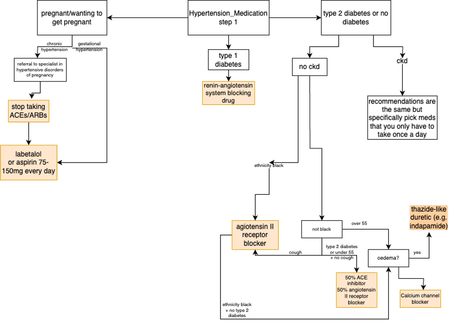
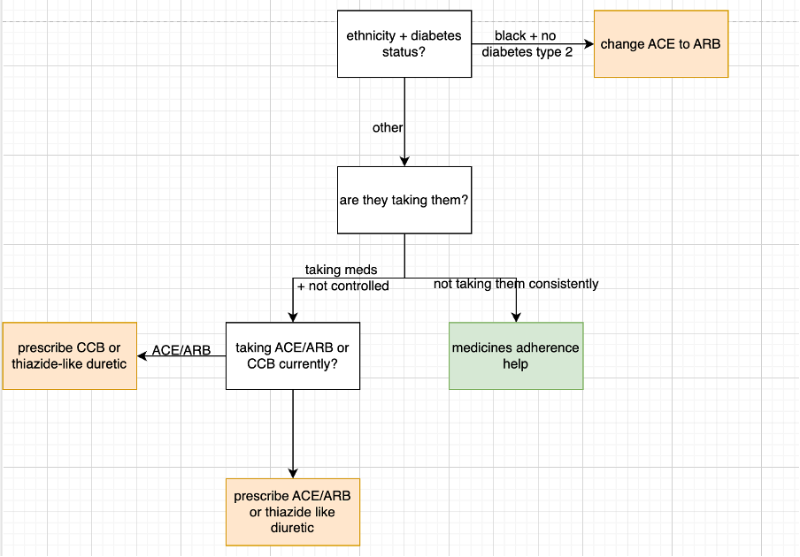
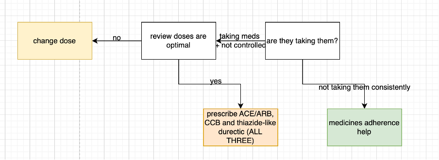

# Creating a New Disease Module in Synthea

## Introduction
This guide will walk you through the steps to create a new disease module in the Synthea synthetic data generator.

## Prerequisites
- Basic knowledge of JSON
- Familiarity with Synthea's module framework
- [NICE guidelines](https://www.nice.org.uk/guidance) for the pathway you want a module for 

## Pre-work 
We recommend starting by creating a flow diagram of the NICE pathway. Consider every condition that might lead to different pathways, and every interaction with the healthcare system (e.g., measurements, tests, appointments, diagnoses, etc.). This will serve as a foundation for developing your module. You can find example flow charts [here](#example-flowchart).

## Steps

### 1. Define the Module
Create a new JSON file in the `src/main/resources/modules` directory. Name it appropriately, e.g., `my_new_disease.json`.

### 2. Structure the Module
A Synthea module consists of states and transitions. Here is a basic structure:

```json
{
    "name": "My New Disease",
    "states": {
        "Initial": {
            "type": "Initial",
            "direct_transition": "DiseaseOnset"
        },
        "DiseaseOnset": {
            "type": "ConditionOnset",
            "target_encounter": "encounter",
            "codes": [
                {
                    "system": "SNOMED-CT",
                    "code": "123456",
                    "display": "My New Disease"
                }
            ],
            "direct_transition": "Terminal"
        },
        "Terminal": {
            "type": "Terminal"
        }
    }
}
```

### 3. Add States and Transitions
Define the states and transitions that represent the progression of the disease. Common states include `ConditionOnset`, `Symptom`, `Encounter`, and `MedicationOrder`. If wanting to define these in a more visual way without needing to write out all the json, try using the Synthea [Module Builder](https://synthetichealth.github.io/module-builder/) and exporting out the json when you're done. 

### 4. Check & Test the Module

Run the simulation with only your module and the base modules active to ensure everything is functioning correctly.

To easily observe the data, modify the `synthea.properties` file by setting `exporter.csv.export = true`. This enables data export in CSV format. Once done, execute the command below to run the simulation.

```sh
./run_synthea -m my_new_disease
```

### 6. Iterate and Improve
Review the generated data and refine your module as needed.

For more detailed information, refer to the [Synthea Module Builder documentation](https://github.com/synthetichealth/synthea/wiki/Adding-a-Module) and the [Generic Module Framework](https://github.com/synthetichealth/synthea/wiki/Generic-Module-Framework).

## Tips & Tricks
- Try your module with made up diagnoses that are easy to spot in your data for ease of testing
- Test as you go! Don't build the whole module & only then test.

## Example Flowchart
These are some example flow charts for the hypertension diagnosis & management NICE guidelines:







